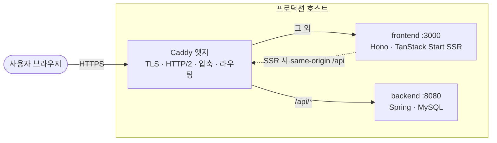
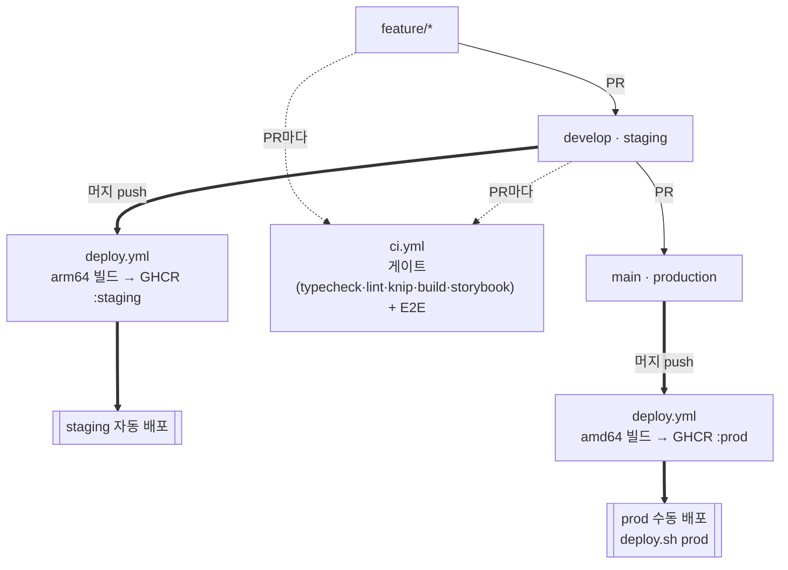

서울대학교 컴퓨터공학부 홈페이지의 프론트엔드 소스코드입니다.

## 기술 스택

- **TanStack Start** (file-based 라우팅, SSR) · React 19 · TypeScript
- **Tailwind CSS v4** (디자인 토큰은 `app/app.css`의 `@theme`)
- **Storybook 10** (공용 컴포넌트 카탈로그) · **Playwright** (E2E + 비주얼 회귀)
- 백엔드: [csereal-server](https://github.com/wafflestudio/csereal-server) (Spring, 세션 인증)

## Getting Started

```sh
git clone https://github.com/wafflestudio/cse.snu.ac.kr
cd cse.snu.ac.kr
pnpm install
pnpm dev
```

필요시 환경 변수를 설정합니다.

```sh
cp env/.env.example env/.env
```

**1. 카카오 맵 API 키** 
- [소개 > 찾아오는 길](https://cse.snu.ac.kr/about/directions) 페이지에서 사용
- 없어도 지도 외 다른 기능은 정상 작동합니다

**2. SSH 설정**
- staging/프로덕션 서버 배포 시 필요
- 관련자에게 전달받아 설정

## 환경 (백엔드 기준)

| 이름 | 백엔드 | 정체 |
|---|---|---|
| production | `cse.snu.ac.kr` | 실서비스 |
| staging | `168.107.16.249.nip.io` | 배포된 프리-프로드(공개 접근) |
| local | `localhost:8080` (docker) | 로컬 E2E/개발 |

## 아키텍처

브라우저는 **한 오리진(앱)만** 호출하고, `/api`는 **서버사이드에서** 백엔드로 프록시된다 → 세션 쿠키(JSESSIONID)가 first-party로 유지돼 CORS·인증 문제가 없다.



- **prod:** Caddy(엣지)가 TLS·압축·라우팅을 맡고 `/api/*`는 백엔드로, 그 외는 frontend 컨테이너로 보낸다.
- **local / E2E:** Caddy 대신 루트 `server.ts`(Hono)가 prod 빌드를 서빙하고 `API_PROXY_TARGET` 설정 시 `/api`를 로컬 docker 백엔드(:8080)로 프록시한다. (자세한 이유·트레이드오프는 `CLAUDE.md` §1.)

## 스크립트

```sh
pnpm dev            # 개발 서버 (vite, API: env/.env.development = staging)
pnpm build          # 프로덕션 빌드 (mode=production)
pnpm build:staging  # staging 빌드 (env/.env.staging)
pnpm build:local    # 로컬 빌드 (상대 /api → server.ts가 로컬 docker로 프록시)
pnpm start          # 빌드된 사이트 실행 = prod 런타임(프록시 없음). 컨테이너 CMD
pnpm preview        # build:local + /api 프록시(:8080) → 로컬에서 직접 클릭

pnpm typecheck      # TypeScript 타입 체크
pnpm lint           # Biome 린트/포맷 검사 (커밋 전 lint-staged가 자동 실행 — 경고도 차단)
pnpm lint:fix       # Biome 자동 수정 (포맷·import 정렬·안전한 수정)
pnpm test           # E2E (핀된 Playwright 컨테이너 = 정본 렌더 환경. 백엔드는 자동 기동)
                    #   로컬·CI 동일(같은 e2e-docker.sh). baseline 재생성: pnpm test --update-snapshots
pnpm knip           # 미사용 파일·export·의존성(프로젝트 레벨 dead code)
pnpm test:ui        # E2E UI 모드 — 호스트 브라우저에서 http://localhost:43210
pnpm lighthouse     # 주요 공개 페이지(=비주얼 테스트 페이지) Lighthouse 점수
                    #   먼저 `pnpm preview`(:3000, 백엔드 :8080)를 띄운 뒤 실행
pnpm storybook      # Storybook (dev, :6006). 배포 시엔 `/storybook` 경로로도 서빙됨
pnpm build-storybook

pnpm deploy:staging # staging 서버 배포(GHCR 이미지 pull)
pnpm deploy:prod    # 프로덕션 배포(GHCR 이미지 pull, 수동 확인)
```

## CI/CD

브랜치: **`feature/*` → `develop`(staging) → `main`(production)**. `main`에 직접 push 금지(PR 필수).



- **PR 게이트(`ci.yml`):** 모든 PR에서 타입/린트/knip/빌드/스토리북 + E2E(핀 컨테이너, 백엔드는 고정 SHA로 체크아웃). 통과해야 머지.
- **빌드·배포(`deploy.yml`):** 머지 시 환경별 이미지를 호스트 arch에 맞춰 네이티브 빌드(staging=arm64, prod=amd64) → GHCR push. **staging은 자동 배포**, **prod는 `deploy.sh prod`로 수동**. 호스트는 빌드 없이 이미지를 pull만 한다.
- **머지 전략:** `feature`→`develop`은 **squash**(기능당 1커밋), `develop`→`main`은 **merge commit**(squash 금지 — long-lived 브랜치라 히스토리가 갈라짐). rebase 머지는 끔.
- **원칙:** CI는 로컬과 같은 스크립트(`pnpm test`·`pnpm lint` 등)를 호출만 한다 — 두 벌 관리하지 않는다. 상세·셋업(시크릿·branch protection)은 `CLAUDE.md` §1 "브랜치·CI/CD 컨벤션".

## 문서

- **`CLAUDE.md`** — 에이전트/기여자용 단일 가이드. 4부 구성: ①아키텍처·환경 ②라우팅·코드 컨벤션 ③E2E 테스트 ④Storybook·디자인 시스템. 작업 전 참고.
- **`tests/COVERAGE.md`** — E2E 라우트 커버리지 추적(단일 출처).

## 참고사항

- ⚠️ 학외망에서 prod 서버 접속시 첫번째 시도는 실패할 수 있습니다.

## 관련 레포

- [wafflestudio/csereal-server](https://github.com/wafflestudio/csereal-server)
- [csereal-web](https://github.com/wafflestudio/csereal-web)
