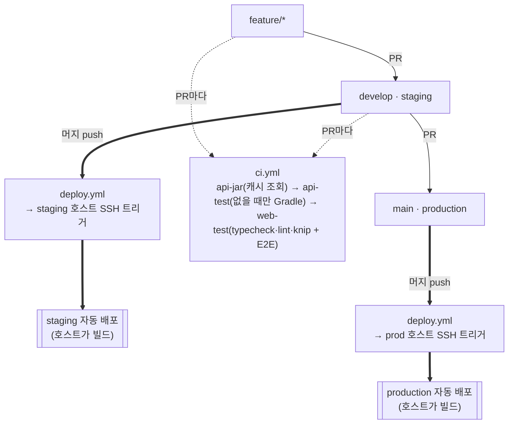

# cse.snu.ac.kr

서울대학교 컴퓨터공학부 홈페이지. 프론트·백엔드·E2E·인프라가 한 레포에 있다(pnpm 워크스페이스).

```
apps/web/        프론트 (TanStack Start + Hono)                → apps/web/README.md
apps/api/        백엔드 (Kotlin/Spring). 옛 csereal-server      → apps/api/README.md
e2e/             Playwright E2E                                → e2e/README.md
infra/           compose 스택(로컬·prod)·Caddy·모니터링·운영 스크립트·배포 대상 → infra/README.md
```

## Getting Started

```sh
git clone https://github.com/wafflestudio/cse.snu.ac.kr
cd cse.snu.ac.kr
pnpm install
pnpm web:dev     # 프론트 개발 서버 (staging 백엔드를 본다)
```

| 명령 | 하는 일 |
| --- | --- |
| `pnpm web:dev` / `web:build` / `web:start` | 프론트 개발 서버 / 프로덕션 빌드 / 빌드 서빙 |
| `pnpm api:up` / `api:down` | 로컬 백엔드 스택(db·search·backend) 기동 / 정지. docker 필요 |
| `pnpm api:test` | 백엔드 단위·통합 테스트(Gradle, testcontainers) |
| `pnpm e2e` | E2E. 백엔드 스택을 띄우고 핀된 Playwright 컨테이너에서 돈다. `pnpm e2e --update-snapshots`, `pnpm e2e:ui` |
| `pnpm test` | `api:test` + `e2e` |
| `pnpm gen:api` | 백엔드 OpenAPI 스펙에서 프론트 API 타입 재생성(기본: 로컬 백엔드) |
| `pnpm typecheck` / `lint` / `knip` | 워크스페이스 전체 |

백엔드 코드를 고쳤으면 `pnpm gen:api` 로 타입을 다시 만들어 커밋한다. `pnpm e2e` 가 백엔드 스펙과 커밋된 타입을 비교해 어긋나면 실패한다.

학외에서 prod·staging 에 붙을 때 드물게 연결이 끊긴다(학교 경계 장비, 앱 버그 아님). 재시도하면 된다.

## CI/CD

브랜치: **`feature/*` → `develop`(staging) → `main`(production)**. `main`·`develop` 직접 push 금지, PR 필수.


```mermaid
flowchart TD
  feat["feature/*"] -->|"PR"| dev["develop · staging"]
  dev -->|"PR"| main["main · production"]

  feat -. "PR마다" .-> ci
  dev -. "PR마다" .-> ci
  ci["ci.yml<br/>api-jar(캐시 조회) → api-test(없을 때만 Gradle) → web-test(typecheck·lint·knip + E2E)"]

  dev ==>|"머지 push"| dstg["deploy.yml<br/>→ staging 호스트 SSH 트리거"] ==> stg[["staging 자동 배포<br/>(호스트가 빌드)"]]
  main ==>|"머지 push"| dprd["deploy.yml<br/>→ prod 호스트 SSH 트리거"] ==> prd[["production 자동 배포<br/>(호스트가 빌드)"]]
```

- **PR 게이트(`ci.yml`):** `api-jar`(이 백엔드로 테스트 통과한 jar 가 캐시에 있나) → `api-test`(없을 때만 테스트 + bootJar) → `web-test`(타입/린트/knip + E2E, 그 jar 로 백엔드 기동). `web-test` 가 통과해야 머지.
- **배포:** 전부 Actions. 빌드는 **호스트에서**(레지스트리 없음, "빌드==배포"). `develop` 머지 → staging, `main` 머지 → production. 프론트는 `deploy.yml`이 호스트에 `infra/ops/deploy-web.sh` 를 보내고, 백엔드는 `deploy.yml`이 `infra/ops/host-deploy.sh` 를 돌린다. 대상은 `infra/production.env`·`infra/staging.env`. 롤백은 revert 커밋.
- **머지 전략:** `feature`→`develop` squash, `develop`→`main` merge commit. rebase 머지 없음.
- **원칙:** CI는 로컬과 같은 스크립트(`pnpm e2e`·`pnpm lint` 등)를 호출만 한다.

## 문서

- `CLAUDE.md` — 레포 전체의 결정·컨벤션·함정(에이전트·기여자용). `apps/web/CLAUDE.md`(프론트), `e2e/CLAUDE.md`(E2E 전략)가 그 아래.
- 각 디렉터리의 `README.md` — 사람용 온보딩.

## 관련 레포

- [wafflestudio/csereal-server](https://github.com/wafflestudio/csereal-server) — 2026-09 이 레포의 `apps/api` 로 합쳐졌다(히스토리 보존). 아카이브 예정.
- [csereal-web](https://github.com/wafflestudio/csereal-web) — 옛 프론트
