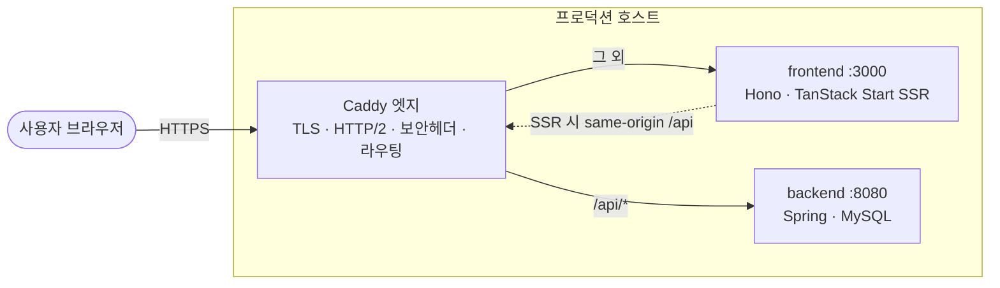
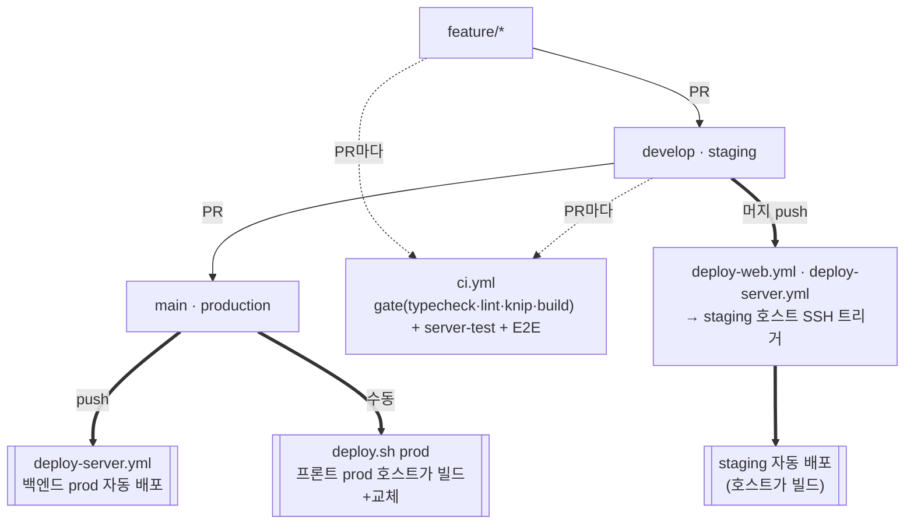

서울대학교 컴퓨터공학부 홈페이지의 프론트엔드 소스코드입니다.

## Getting Started

```sh
git clone https://github.com/wafflestudio/cse.snu.ac.kr
cd cse.snu.ac.kr
pnpm install
pnpm dev        # = pnpm --filter web dev
```

한 레포에 프론트·백엔드·E2E 가 함께 있습니다(pnpm 워크스페이스).

```
apps/web/        프론트 (TanStack Start + Hono)
apps/server/     백엔드 (Kotlin/Spring). 옛 csereal-server — 자체 README 참고
packages/e2e/    Playwright E2E
compose.yml      로컬 백엔드 스택(db·search·backend) — pnpm backend:up / pnpm test 가 쓴다
scripts/         배포·E2E 러너·API 타입 생성
```

필요시 환경 변수를 설정합니다.

```sh
cp apps/web/env/.env.example apps/web/env/.env
```

**1. 카카오 맵 API 키**

- [소개 > 찾아오는 길](https://cse.snu.ac.kr/about/directions) 페이지에서 사용
- 없어도 지도 외 다른 기능은 정상 작동합니다

**2. SSH 접근** (배포 시에만 필요)

- 공개키를 배포 호스트에 등록해달라고 관련자에게 요청합니다
- 그 키를 각자 SSH 환경에 맞게 설정합니다 — `ssh-agent`에 로드하거나 `~/.ssh/config`의 `IdentityFile`로 지정(1Password·키 파일 등 도구는 무관). 호스트·유저·포트는 `deploy.sh`에 있어 따로 설정할 필요가 없습니다

## 서버 환경

사용하는 서버는 빌드 mode로 정해집니다(`vite.config.ts`의 mode→URL 매핑).

| 이름          | 백엔드                    |
| ------------- | ------------------------- |
| 실서비스      | `cse.snu.ac.kr`           |
| 테스트용 서버 | `168.107.16.249.nip.io`   |
| 로컬 E2E      | `localhost:8080` (docker) |

학외에서 prod에 붙을 때 드물게 연결이 끊길 수 있습니다(앱 버그 아님, 학내에선 안 나타남). 재시도하면 됩니다.

## 아키텍처


```mermaid
flowchart LR
  user(["사용자 브라우저"])
  subgraph prod["프로덕션 호스트"]
    edge["Caddy 엣지<br/>TLS · HTTP/2 · 보안헤더 · 라우팅"]
    fe["frontend :3000<br/>Hono · TanStack Start SSR"]
    be["backend :8080<br/>Spring · MySQL"]
  end
  user -->|HTTPS| edge
  edge -->|"그 외"| fe
  edge -->|"/api/*"| be
  fe -. "SSR 시 same-origin /api" .-> edge
```

- **prod:** Caddy(엣지)가 TLS·라우팅·보안 헤더(`-Server`·`X-XSS-Protection`)를 맡고 `/api/*`는 백엔드로, 그 외는 frontend 컨테이너로 보냅니다.
- **지표:** frontend 컨테이너가 `:9464/metrics`로 Prometheus 지표(요청 수·응답시간·Node 런타임)를 냅니다. 수집·대시보드·경보는 백엔드 레포 `monitoring/`에 있습니다.
- **local / E2E:** 루트 `server.ts`(Hono)가 빌드를 서빙하고 `API_PROXY_TARGET` 설정 시 `/api`를 로컬 docker 백엔드(:8080)로 프록시합니다. (자세한 이유·트레이드오프는 `CLAUDE.md` §1.)

## 인증

쿠키(**JSESSIONID**) 기반 인증을 사용합니다. OAuth(`id.snucse.org`)로 세션을 발급받습니다.

## 코드 구조 (apps/web)

```
src/
  routes/          URL을 그대로 미러링하는 file-based 라우팅 (→ routeTree.gen.ts 자동 생성)
    $locale/         /ko·/en 프리픽스가 붙는 페이지 전부
    admin/  [.]internal/  img.ts  sitemap[.]xml.ts    로케일 없는 라우트
    __root.tsx       문서 셸 · 로케일 리다이렉트 · 세션 역할
  components/      여러 라우트가 공유하는 것만
    ui/              제어 프리미티브 (value/onChange)
    form/            react-hook-form 어댑터 (name + useFormContext)
    layout/          앱 셸 — Header/Footer/Nav/PageLayout/NotFound
    feature/         도메인 위젯 (auth·category·content·SearchBox·selection)
  hooks/  utils/  types/  constants/
server.ts          Hono 진입점 — 빌드 산출물 서빙 + (local) /api 프록시
```

E2E 는 `packages/e2e/tests/` 에 라우트별 `read.spec.ts` / `flow.spec.ts` 로 있습니다.

**라우트별 파일은 그 라우트 폴더에 co-locate합니다.** 비라우트 파일/폴더는 이름을 **`-`로 시작**하게 둡니다 — `-components/`·`-hooks/`·`-api.ts` 등. TanStack Router가 `-` 프리픽스로 시작하는 항목을 라우트 생성에서 자동 제외하므로(프레임워크 기본값 `routeFileIgnorePrefix='-'`), 커스텀 정규식 없이 이름 규칙 하나로 끝납니다. 여러 라우트에서 재사용하게 되면 `src/components/`로 승격합니다.

**모든 페이지 URL은 `/ko`·`/en`으로 시작합니다.** 프리픽스 없는 주소(`/about`)는 쿠키·`Accept-Language`로 언어를 감지해 302로 리다이렉트됩니다. 링크를 만들 땐 문자열로 `/${locale}/...`를 조립하지 말고 **`localizedPath()`** 를 씁니다.

## 테스트

`pnpm test`(E2E)는 **로컬 docker 백엔드**가 필요합니다(`pnpm dev`는 staging 백엔드를 보므로 불필요). 백엔드는 같은 커밋의 `apps/server` 소스에서 루트 `compose.yml` 로 자동 기동됩니다 — 별도 체크아웃이 없습니다. 비주얼 baseline 도 그 백엔드 기준입니다.

백엔드 단위 테스트는 `cd apps/server && ./gradlew test`.

## CI/CD

브랜치: **`feature/*` → `develop`(staging) → `main`(production)**. `main`에 직접 push는 금지이고 PR이 필수입니다.


```mermaid
flowchart TD
  feat["feature/*"] -->|"PR"| dev["develop · staging"]
  dev -->|"PR"| main["main · production"]

  feat -. "PR마다" .-> ci
  dev -. "PR마다" .-> ci
  ci["ci.yml<br/>gate(typecheck·lint·knip·build) + server-test + E2E"]

  dev ==>|"머지 push"| dstg["deploy-web.yml · deploy-server.yml<br/>→ staging 호스트 SSH 트리거"] ==> stg[["staging 자동 배포<br/>(호스트가 빌드)"]]
  main ==>|"push"| dsrv[["deploy-server.yml<br/>백엔드 prod 자동 배포"]]
  main ==>|"수동"| prd[["deploy.sh prod<br/>프론트 prod 호스트가 빌드+교체"]]
```

- **PR 게이트(`ci.yml`):** 모든 PR에서 타입/린트/knip/빌드 + E2E(핀 컨테이너, 같은 커밋의 `apps/server` 로 백엔드 기동)를 돌리고, 통과해야 머지됩니다. `apps/server` 가 바뀐 PR 은 Gradle 테스트도 돕니다.
- **빌드·배포:** 빌드는 **호스트에서** 합니다(레지스트리 없음, "빌드==배포"). 프론트는 `develop` 머지 시 `deploy-web.yml`이 staging 호스트에 SSH로 트리거해 git URL로 `docker build -f apps/web/Dockerfile` + 컨테이너 교체하고, **prod는 `deploy.sh prod`로 수동**입니다. 백엔드는 `deploy-server.yml`이 `develop`→staging, `main`→production 으로 자동 배포합니다(`apps/server/ops/host-deploy.sh`). CI는 배포 이미지를 만들지 않고 게이트만 담당합니다. 롤백은 이전 커밋 sha로 재빌드(`deploy.sh <env> <sha>`).
- **머지 전략:** `feature`→`develop`은 **squash**(기능당 1커밋), `develop`→`main`은 **merge commit**입니다(squash 금지 — long-lived 브랜치라 히스토리가 갈라짐). rebase 머지는 끕니다.
- **원칙:** CI는 로컬과 같은 스크립트(`pnpm test`·`pnpm lint` 등)를 호출만 합니다 — 두 벌 관리하지 않습니다. 

## 문서

- **`CLAUDE.md`** — 에이전트/기여자용 단일 가이드. 4부 구성: ①아키텍처·환경 ②라우팅·코드 컨벤션 ③E2E 테스트 ④디자인 시스템. 작업 전에 참고하세요.

## 관련 레포

- [wafflestudio/csereal-server](https://github.com/wafflestudio/csereal-server) — 2026-09 이 레포의 `apps/server` 로 합쳐졌습니다(히스토리 보존). 아카이브 예정.
- [csereal-web](https://github.com/wafflestudio/csereal-web) — 옛 프론트
