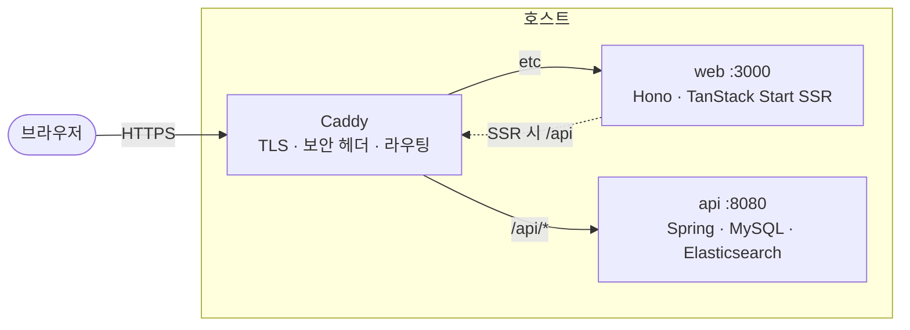

<p align="center"></p>

서울대학교 컴퓨터공학부 홈페이지의 소스코드입니다.

## 구조

| 디렉터리 | 분류 | 기술 스택 |
| --- | --- | --- |
| [`apps/web`](apps/web) | 프론트 | TanStack Start |
| [`apps/api`](apps/api) | 백엔드 | Kotlin · Spring Boot · MySQL · Elasticsearch |
| [`e2e`](e2e) | E2E | Playwright |
| [`infra`](infra) | 배포 | compose · Caddy · 모니터링 |


## 인프라


```mermaid
flowchart LR
  user(["브라우저"])
  subgraph host["호스트"]
    edge["Caddy<br/>TLS · 보안 헤더 · 라우팅"]
    web["web :3000<br/>Hono · TanStack Start SSR"]
    api["api :8080<br/>Spring · MySQL · Elasticsearch"]
  end
  user -->|HTTPS| edge
  edge -->|"etc"| web
  edge -->|"/api/*"| api
  web -. "SSR 시 /api" .-> edge
```

OAuth(`id.snucse.org`)로 발급되는 세션 쿠키 `JSESSIONID`를 사용해 인증합니다. (학내망에서만 가능)

## 서버

| | 주소 | 브랜치 | |
| --- | --- | --- | --- |
| production | https://cse.snu.ac.kr | `main` | 학내 호스트. 학외에서 드물게 연결이 끊기면 재시도하면 됩니다. |
| staging | https://168.107.16.249.nip.io | `develop` | 클라우드. 데이터는 production 과 별개입니다 |

브랜치에 push 되면 자동으로 배포됩니다.

## 시작하기

패키지와 환경변수를 세팅합니다. 

```sh
pnpm install
cp apps/web/env/.env.example apps/web/env/.env   # 카카오 맵 API 키. 없어도 지도 외 기능은 동작합니다
```

```sh
# staging 백엔드를 사용합니다. 
pnpm web:dev                   

# 백엔드도 직접 띄우려면 도커가 필요합니다.
pnpm api:up                                            # MySQL · Elasticsearch · Spring. :8080
VITE_API_BASE_URL=http://localhost:8080 pnpm web:dev   # 프론트가 로컬 백엔드를 보게 합니다
```

로컬/staging 백엔드는 OAuth 대신 `/api/v2/mock-login` 으로 staff 세션을 만듭니다. 

| 명령어 | 설명 |
| --- | --- |
| `pnpm web:dev` `web:build` `web:start` | 프론트. `web:start` 는 `server.ts` 로 빌드 산출물을 서빙합니다(prod 와 같은 서버) |
| `pnpm api:up` `api:down` `api:test` | 백엔드 스택 · Gradle 테스트 |
| `pnpm e2e` | E2E. `--update-snapshots` 로 baseline 을 갱신합니다 |
| `pnpm test` | `api:test` + `e2e` |
| `pnpm gen:api` | 백엔드 스펙에서 프론트 API 타입을 생성합니다 |
| `pnpm typecheck` `lint` `knip` | 정적 검사 |

## 프론트 코드 구조

```
apps/web/
  server.ts          Hono 진입점 — 빌드 산출물 서빙 + (로컬) /api 프록시
  src/
    routes/          URL 을 미러링하는 file-based 라우팅 (→ routeTree.gen.ts 자동 생성)
      $locale/         /ko·/en 프리픽스가 붙는 페이지 전부
      admin/  [.]internal/  img.ts  sitemap[.]xml.ts    로케일 없는 라우트
      __root.tsx       문서 셸 · 로케일 리다이렉트 · 세션 역할
    components/      여러 라우트가 공유하는 것만
      ui/              제어 프리미티브 (value/onChange)
      form/            react-hook-form 어댑터 (name + useFormContext)
      layout/          앱 셸 — Header/Footer/Nav/PageLayout/NotFound
      feature/         도메인 위젯 (auth·category·content·SearchBox·selection)
    hooks/  utils/  serverFns/  types/  constants/
```

라우트별 파일은 그 라우트 폴더에 두고 이름을 `-` 로 시작합니다(`-components/`·`-api.ts`). TanStack Router 가 `-` 프리픽스를 라우트 생성에서 제외합니다. 여러 라우트에서 쓰게 되면 `src/components/` 로 올립니다.

모든 페이지 URL 은 `/ko`·`/en` 으로 시작합니다. 링크는 `localizedPath()` 로 만듭니다.

## 브랜치

작업은 별도 브랜치에서 하고 `develop` 으로 PR을 보냅니다. 급한 수정은 `hotfix/*` 에서 `main` 으로 보내고 `develop` 에 되가져옵니다. 두 브랜치 모두 직접 push 는 막혀 있습니다.

머지는 `feature` → `develop` 은 squash, `develop` → `main` 은 merge commit 입니다.

## PR

CI가 통과되어야 머지됩니다.

| 잡 | 하는 일 |
| --- | --- |
| `api-jar` | 백엔드 소스의 내용 해시로, 이미 테스트된 jar 가 캐시에 있는지 봅니다. |
| `api-test` | jar가 없을 때만 돕니다. Gradle 테스트 + bootJar, 통과하면 캐시에 넣습니다. |
| `web-test` | typecheck · lint · knip 뒤에 E2E. 백엔드는 위 jar 로 띄웁니다.|

백엔드 API 를 고쳤으면 `pnpm gen:api` 로 프론트 타입을 다시 만들어 같은 PR 에 넣습니다. `pnpm e2e` 가 스펙과 타입을 비교해 어긋나면 실패합니다.

## 배포

머지하면 자동 배포됩니다. `develop`은 staging에 `main`은 production에 배포합니다. 롤백은 revert PR을 올려 일반 배포 프로세스와 동일하게 진행합니다. 

GitHub 에는 Environment `production`·`staging` 의 시크릿 `SSH_KEY` 와 레포 시크릿 `KAKAO_MAP_KEY`(웹 빌드 arg) 가 있습니다. 나머지 비밀은 호스트 `~/secrets/` 에 둡니다.

| | |
| --- | --- |
| `app.env` | `MYSQL_ROOT_PASSWORD` `MYSQL_USER` `MYSQL_PASSWORD` `MYSQL_DATABASE` `OIDC_CLIENT_SECRET`(prod) |
| `monitoring.env` | `GF_SECURITY_ADMIN_PASSWORD` · `GF_SMTP_*`(prod) |
| `certs/` | TLS 인증서·키. `production.env` 의 경로와 맞아야 합니다 |
| `backup_offsite` | 백업용 SSH 개인키(prod) |

### DB 백업 복원

백업은 매일 자정 호스트 `~/database/backup/` 에 남습니다([`infra/ops/db-backup.sh`](infra/ops/db-backup.sh)).

```sh
docker run -d --name restore-test -e MYSQL_ROOT_PASSWORD=x -e MYSQL_DATABASE=csereal mysql:8.0
gunzip -c ~/database/backup/mysqldump-YYYY-MM-DD.gz | docker exec -i restore-test mysql -uroot -px csereal
```
