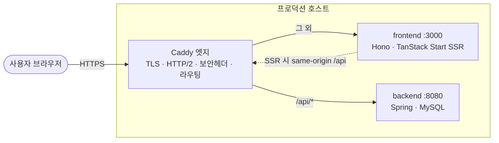

# apps/web

cse.snu.ac.kr 프론트. TanStack Start(SSR) + Hono(`server.ts`). 레포 루트에서 `pnpm web:dev` 로 띄운다.

## 환경 변수

```sh
cp env/.env.example env/.env
```

**카카오 맵 API 키** — [소개 > 찾아오는 길](https://cse.snu.ac.kr/about/directions) 페이지에서 사용. 없어도 지도 외 다른 기능은 정상 작동한다. 배포 빌드에는 Actions 시크릿 `KAKAO_MAP_KEY` 가 build-arg 로 들어간다.

## 서버 환경

사용하는 서버는 빌드 mode로 정해집니다(`vite.config.ts`의 mode→URL 매핑).

| 이름          | 백엔드                    |
| ------------- | ------------------------- |
| 실서비스      | `cse.snu.ac.kr`           |
| 테스트용 서버 | `168.107.16.249.nip.io`   |
| 로컬 E2E      | `localhost:8080` (docker) |

학외에서 prod에 붙을 때 드물게 연결이 끊길 수 있습니다(앱 버그 아님, 학내에선 안 나타남). 재시도하면 됩니다.

## 아키텍처



- **prod:** Caddy(엣지)가 TLS·라우팅·보안 헤더(`-Server`·`X-XSS-Protection`)를 맡고 `/api/*`는 백엔드로, 그 외는 frontend 컨테이너로 보냅니다.
- **지표:** frontend 컨테이너가 `:9464/metrics`로 Prometheus 지표(요청 수·응답시간·Node 런타임)를 냅니다. 수집·대시보드·경보는 백엔드 레포 `monitoring/`에 있습니다.
- **local / E2E:** 루트 `server.ts`(Hono)가 빌드를 서빙하고 `API_PROXY_TARGET` 설정 시 `/api`를 로컬 docker 백엔드(:8080)로 프록시합니다. (자세한 이유·트레이드오프는 `CLAUDE.md` §1.)

## 인증

쿠키(**JSESSIONID**) 기반 인증을 사용합니다. OAuth(`id.snucse.org`)로 세션을 발급받습니다.

## 코드 구조

```
src/
  routes/          URL을 그대로 미러링하는 file-based 라우팅 (→ routeTree.gen.ts 자동 생성)
    $locale/         /ko·/en 프리픽스가 붙는 페이지 전부
    admin/  [.]internal/  img.ts  sitemap[.]xml.ts    로케일 없는 라우트
    __root.tsx       문서 셸 · 로케일 리다이렉트 · 세션 역할
  components/      여러 라우트가 공유하는 것만
    ui/              제어 프리미티브 (value/onChange)
    form/            react-hook-form 어댑터 (name + useFormContext)
    layout/          앱 셸 — Header/Footer/Nav/PageLayout/NotFound
    feature/         도메인 위젯 (auth·category·content·SearchBox·selection)
  hooks/  utils/  types/  constants/
server.ts          Hono 진입점 — 빌드 산출물 서빙 + (local) /api 프록시
```

E2E 는 `e2e/tests/` 에 라우트별 `read.spec.ts` / `flow.spec.ts` 로 있습니다.

**라우트별 파일은 그 라우트 폴더에 co-locate합니다.** 비라우트 파일/폴더는 이름을 **`-`로 시작**하게 둡니다 — `-components/`·`-hooks/`·`-api.ts` 등. TanStack Router가 `-` 프리픽스로 시작하는 항목을 라우트 생성에서 자동 제외하므로(프레임워크 기본값 `routeFileIgnorePrefix='-'`), 커스텀 정규식 없이 이름 규칙 하나로 끝납니다. 여러 라우트에서 재사용하게 되면 `src/components/`로 승격합니다.

**모든 페이지 URL은 `/ko`·`/en`으로 시작합니다.** 프리픽스 없는 주소(`/about`)는 쿠키·`Accept-Language`로 언어를 감지해 302로 리다이렉트됩니다. 링크를 만들 땐 문자열로 `/${locale}/...`를 조립하지 말고 **`localizedPath()`** 를 씁니다.


## 빌드 · 서빙

`pnpm web:build` 가 `dist/` 를 만들고 `pnpm web:start`(`server.ts`) 가 그것을 서빙한다. prod 컨테이너·E2E 가 같은 서버를 쓴다. 이미지는 `Dockerfile`(컨텍스트는 레포 루트 — 워크스페이스 lockfile 이 거기 있다).

결정의 이유·함정은 `CLAUDE.md`(이 디렉터리).
