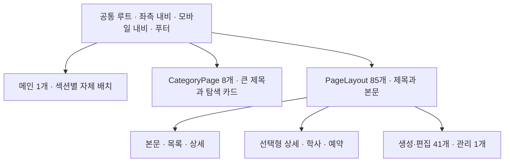

# 기존 화면 조사

[진행 현황](PLAN.md) · [전체 라우트 목록](ROUTES.md)

## 이번 조사에서 확인한 범위

기준은 재시작한 브랜치의 앱 소스 `d1baf83c`다. 이전 디자인 시스템 브랜치의 규칙은 가져오지 않았다.
라우트 선언과 컴포넌트 의존 관계를 수집하고, 공통 틀·패턴의 구현 및 기존 E2E 스크린샷 8장을 확인했다.
이번 기록은 **화면 범위와 패턴 지도**다. 색·글자·간격의 전수 계측이나 새 렌더링 검증은 아직 하지 않았다.

`createFileRoute` 선언 99개 중 화면 템플릿은 **94개**다. 열람 목적 52개, 생성·편집 목적 41개,
관리 1개로 나뉜다. 언어·학부/대학원·게시물 ID·시설별 URL을 펼친 숫자는 아니다.
`Outlet` 전용 래퍼 2개와 서버 응답 3개는 제외했다. 오류·빈 상태는 URL 개수와 별도로 조사한다.
전체 라우트를 [ROUTES.md](ROUTES.md)에 한 번씩 연결했다.

## 화면 지도

| 화면 유형 | 수 | 대표 | 함께 조사해야 하는 변형 |
| --- | ---: | --- | --- |
| 메인 | 1 | `/` | 히어로, 뉴스 캐러셀, 중요 안내, 공지 필터, 이미지 팝업 |
| 카테고리 | 8 | `/about`, `/academics` | 소개문 유무, 바로 이동하는 카드와 하위 분류를 여는 카드 |
| 안내 본문 | 13 | `/about/overview`, `/about/greetings` | 사진 배치, HTML 본문, 첨부, 입학·학사 안내, 내부 안내 |
| 선택형 상세 | 5 | `/research/groups` | 동아리·센터·길찾기·예약 안내의 선택 목록과 상세 교체 |
| 목록·검색·표 | 6 | `/community/notice`, `/search` | 공지·뉴스·세미나·연구실·학회 목록의 서로 다른 행 구조 |
| 대상 상세 | 8 | 공지·교수·연구실 상세 | 게시물 3종, 장학 상세, 인물 3종, 연구실 소개의 다른 정보 위계 |
| 인물 목록·복합 소개 | 5 | `/people/faculty`, `/about/future-careers` | 인물 3종, 시설 사진 목록, 진로 통계와 기업 목록 |
| 학사 도구·연도별 콘텐츠 | 5 | 학부 교과목·이수 표준 형태 | 교과목 표/카드, 연도 선택 3종, 장학 안내와 목록 |
| 예약 달력 | 1 | `/reservations/seminar-room/301-417` | 방별 정보, 날짜 이동, 예약 블록·모달, 이용 권한 |
| 생성·편집 | 41 | `/community/notice/create` | 단순 본문·복합 폼·한영 입력·사진/첨부·정렬·저장 상태 |
| 관리 | 1 | `/admin` | 슬라이드·중요 안내·이미지 팝업의 메뉴별 작업 |
| **합계** | **94** | | |

유형은 조사 항목을 찾기 위한 분류다. 예를 들어 게시물 상세와 교수 상세가 같은 유형에 있어도
같은 레이아웃이나 컴포넌트로 합치기로 정한 것은 아니다. 이름보다 실제 정보 구조를 보고 판단한다.

## 공통 틀과 패턴

화면의 큰 틀은 세 갈래다.

`PageLayout`의 85개에는 열람 43개와 생성·편집 41개, 관리 1개가 포함된다.
메인과 카테고리의 여백을 일반 본문과 따로 확인해야 한다. `PageLayout` 안에서도
`padding="none"`을 쓰는 화면은 내부 섹션이 배치와 배경을 직접 소유한다.

| 공통 구현 | 연결된 사용처 | 조사할 경계 |
| --- | --- | --- |
| [PageLayout](../../apps/web/src/components/layout/PageLayout/index.tsx), Header, Footer | 화면 틀 85개 | 제목·본문·보조 내비의 폭과 정렬, 내부 섹션의 배치 재정의 |
| [CategoryPage](../../apps/web/src/components/feature/category/CategoryPage.tsx) | 카테고리 8개 | 큰 제목, 설명문, 카드의 이동/선택 차이 |
| [HTMLViewer](../../apps/web/src/components/ui/HTMLViewer.tsx) | 열람 템플릿 29개의 import 경로 | 실제 서체, 작성된 HTML, 이미지·표·첨부와 본문 흐름 |
| [SelectionList](../../apps/web/src/components/feature/selection/SelectionList.tsx) | 선택형 상세 5개와 관리 1개 | 접힌 모서리, 선택 표시, 긴 이름, 선택 후 내용 |
| [SearchBox](../../apps/web/src/components/feature/SearchBox/index.tsx) | 공지·뉴스·통합검색 | 검색·태그·선택 조건 표시; 세미나는 별도의 검색 UI |
| [PeopleGrid](../../apps/web/src/routes/$locale/people/-components/PeopleGrid.tsx) | 교수·역대 교수·직원 목록 | 사진, 이름·직함·연락처, 가로/세로 배치 |
| [TimelineViewer](../../apps/web/src/routes/$locale/academics/-components/timeline/TimelineViewer.tsx) | 교과목 변경·이수 표준·필수 교양 3개 | 연도 선택, 한 해 여러 항목, 펼침, 편집 행동 |
| [Form](../../apps/web/src/components/form/Form.tsx), [Fieldset](../../apps/web/src/components/form/Fieldset.tsx) | 생성·편집과 교과목·예약 등의 모달 | 값 입력, 라벨, 검증, 파일, 한영 입력, 본문 에디터 |
| Button·Tag·Dropdown·Dialog·AlertDialog·Calendar | 여러 화면의 조작 | 기본 모양뿐 아니라 키보드·초점·오류·선택·처리 중 상태 |

횟수는 로컬 import 의존 관계를 따라 센 **화면 템플릿 수**다. 화면에 보이는 인스턴스 수나
렌더링 빈도로 해석하지 않는다. 컴포넌트의 조건부 표시와 반복 횟수는 다음 조사에서 별도로 확인한다.

## 빠뜨리기 쉬운 화면과 상태

- **메뉴에 없는 화면:** 10-10 프로젝트 4개, `/.internal` 열람·편집, 통합검색, `/admin`도 범위에 포함한다.
- **같은 URL의 다른 배치:** 교과목 표/카드, 교수 정렬, 선택형 상세, 연도별 콘텐츠, 관리자 메뉴가 있다.
- **URL이 없는 화면:** 교과목 상세·추가, 예약 상세·추가, 삭제 확인, 달력 펼침, 메인 이미지 팝업을 따로 잡는다.
- **일반 UI와 폼 UI:** `ui/Checkbox`와 `form/Checkbox`, 두 Dropdown처럼 같은 이름의 독립 구현을 모두 조사한다.
- **본문과 편집기:** `suneditor-contents.override.css`와 에디터 override는 우리 관리 범위다.
  사용자가 작성한 본문의 서식 및 서드파티 도구 내부와 구분해 기록한다.
- **피드백:** 404, RootErrorBoundary, ErrorState, 빈 검색 결과, 토스트, 업로드·저장 실패를 포함한다.
- **권한:** 공개 화면 안의 편집 버튼과 로그인 후 화면/모달을 별도로 확인한다.
  `/admin`은 코드상 로그인 검사가 있다. 조사 분류 자체가 권한 검증 결과는 아니다.

## 현재 화면에서 관찰한 특징

아래는 소스와 기존 스크린샷에서 확인한 사실 및 다음 질문이다. **유지하기로 확정한 원칙은 아니다.**

| 관찰 | 근거 | 다음에 판단할 것 |
| --- | --- | --- |
| 메인·카테고리는 어두운 큰 면을 쓰고, 일반 페이지는 어두운 제목 뒤에 밝은 본문이 이어진다 | 메인·소개·공지 상세 스크린샷, 세 갈래 화면 틀 | 이 대비를 사이트의 기본 구조로 유지할지 |
| 주황은 그래픽·선택·이동·강조에 반복된다 | 메인 그래픽, SelectionList, 보조 내비, 태그 | 브랜드 표현과 정보·상태 전달에서 구분할 역할 |
| 원과 직선·사선이 제목, 보조 내비, 검색, 연결 정보에 나타난다 | [Nodes](../../apps/web/src/components/ui/Nodes.tsx), PageTitle, SubNavbar, PeopleLabNode | 관계를 나타내는 표시와 장식적 구분의 경계 |
| 접힌 모서리가 선택 항목과 연구실 소개에 쓰인다 | SelectionList, 연구실 상세, CornerFoldedRectangle | 같은 모양이 선택·요약·클릭 가능성 중 무엇을 뜻하는지 |
| 메인 슬로건에 별도 서체와 원·막대 그래픽이 있다 | [GraphicSection](../../apps/web/src/routes/$locale/-components/GraphicSection.tsx), MainGraphic | 일반 정보 UI와 별도로 유지할 표현의 범위 |
| 목록·표·관리 폼의 정보 밀도와 소개 화면의 여백이 다르다 | 공지·교과목과 메인·카테고리의 구조 | 읽는 글과 조작·탐색 정보에 필요한 밀도 차이 |

현재 가설은 ‘어두운 탐색 영역, 밝은 읽기 영역, 주황과 기하학적 표시’가 함께 사이트의 특징을
만든다는 것이다. 이를 모두 유지할지, 쓰는 범위만 정리할지, 일부 바꿀지는 2단계에서 검토한다.

## 다음에 수집할 대표 화면과 변형

기본 화면만 모으면 조작 상태가 빠지므로, 아래 단위로 기준 화면을 수집한다. `$id`는 로컬 데이터의
목록에서 항목을 선택해 확인한다. URL을 임의의 숫자로 고정하지 않는다.

| 묶음 | 첫 대표 화면 | 반드시 함께 볼 변형·추가 화면 |
| --- | --- | --- |
| 메인·셸 | `/` | 넓고 좁은 화면, 내비 열림, 캐러셀, 공지 필터, 이미지 팝업 |
| 카테고리 | `/about`, `/academics` | 소개문 재배치, 하위 분류 선택, 긴 영문 카드 |
| 읽는 글 | `/about/overview`, `/about/greetings` | 긴 문단, 이미지, 첨부, 본문 속 표; 입학·학사 안내 대조 |
| 검색·목록 | `/community/notice`, `/search` | 고정 공지, 필터·페이지 이동, 긴 제목, 빈 결과; 뉴스·세미나·연구실 행 대조 |
| 게시물 | 공지 상세 | 첨부·태그·이전/다음, 긴 제목; 뉴스 이미지와 세미나 연사 정보 추가 |
| 선택형 상세 | `/research/groups`, `/research/centers` | 복수 선택지와 긴 이름; 동아리·지도·예약 안내의 고유 콘텐츠 |
| 인물 | `/people/faculty` 및 상세 | 목록 정렬, 연락처, 긴 영문; 직원·역대 교수의 다른 상세 배치 |
| 연구실 소개 | 연구실 상세 | 접힌 소개 패널, 구성원·링크·본문의 배치 |
| 복합 소개 | `/about/future-careers`, `/about/facilities` | 통계·기업 목록, 시설 사진·설명; 학회 표의 가로 이동 대조 |
| 교과목 | `/academics/undergraduate/courses` | 표/카드, 정렬, 상세·추가 모달, 대학원·영문 |
| 연도·학사 안내 | `/academics/undergraduate/curriculum` | 연도 전환·다중 항목 펼침; 교과목 변경·필수 교양·장학 목록 대조 |
| 예약 | `/reservations/seminar-room/301-417` | 고정 날짜, 날짜 이동, 예약 유무, 권한, 추가/상세 모달 |
| 복합 편집 | `/community/notice/create` | 필수 오류, 날짜 선택, 첨부, 태그 제안의 처리·결과·실패 상태 |
| 한영·사진 편집 | `/people/faculty/create` | 언어 전환, 사진, 반복 입력; 단순 본문 편집과 대조 |
| 관리 | `/admin` | 메뉴 3개, 항목 선택·일괄 행동·확인, 팝업 등록/편집 |
| 피드백 | 존재하지 않는 주소, 빈 검색 | 오류 화면·토스트·처리 중 등 관련 화면에 연결해 기록 |

최초 수집은 기존 기준인 **한국어 390px·1280px**와 연결한다. 그 뒤 대표 묶음에 영어, 360px,
중간 폭 768/1024px, 넓은 1920px, 실제 전환점 직전·직후를 보충한다.
모든 화면에 모든 조합을 기계적으로 곱하지 않고, 변형의 영향을 받는 패턴에 적용한다.
이 폭들은 조사용 표본이며 새 디자인 시스템의 브레이크포인트 결정이 아니다.

## 기존 시각 자료와 한계

현재 저장소에는 E2E PNG **116장(데스크톱 58장·모바일 58장)**이 있다. 기존 read 프로젝트는
한국어 기준이며 데스크톱 1280px, 모바일 390px이다. 편집·관리 flow는 동작 테스트와 구분해서
시각 자료를 보충해야 한다. 이 개수로 모든 화면과 상태가 검증됐다고 판단하지 않는다.

이번에 직접 확인한 기존 파일:

| 화면 | 자료 |
| --- | --- |
| 메인 · 1280 | [스크린샷](../../e2e/tests/main/read.spec.ts-snapshots/main-ko-read-linux.png) |
| 소개 카테고리 · 1280 | [스크린샷](../../e2e/tests/about/index/read.spec.ts-snapshots/about-index-ko-read-linux.png) |
| 소개 카테고리 · 390 | [스크린샷](../../e2e/tests/about/index/read.spec.ts-snapshots/about-index-ko-read-mobile-linux.png) |
| 연구 스트림 · 1280 | [스크린샷](../../e2e/tests/research/groups/read.spec.ts-snapshots/groups-ko-read-linux.png) |
| 교수 상세 · 1280 | [스크린샷](../../e2e/tests/people/faculty/read.spec.ts-snapshots/faculty-detail-ko-read-linux.png) |
| 교과목 목록 · 1280 | [스크린샷](../../e2e/tests/academics/courses/read.spec.ts-snapshots/courses-ko-read-linux.png) |
| 예약 달력 · 390 | [스크린샷](../../e2e/tests/reservations/room/read.spec.ts-snapshots/reservation-room-ko-read-mobile-linux.png) |
| 공지 상세 · 1280 | [스크린샷](../../e2e/tests/community/notice/read.spec.ts-snapshots/notice-detail-ko-read-linux.png) |

사진·일부 동적 영역의 자홍색은 테스트 마스크다. 디자인 팔레트나 실제 콘텐츠로 해석하지 않는다.
교수 상세는 정보가 적고 교과목은 한 행, 공지 본문은 짧다. 이 자료만으로 여백·행간·긴 콘텐츠의
적합성을 결론 내릴 수 없다. 새 렌더링과 영어·상태·긴 콘텐츠의 수집은 다음 작업이다.
